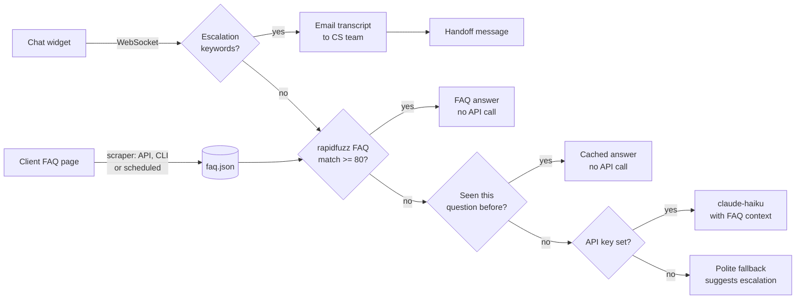

# Trinops Comms Bot

Embeddable 24/7 chat widget for small-business websites, with automatic FAQ training and human escalation. Built as a client project, genericised for portfolio — all company-specific values live in `.env`.

## The problem

Small businesses can't staff a chat widget around the clock, but visitors expect instant answers. And the usual fix — a chatbot platform — makes updating the bot's knowledge a technical chore. This bot trains itself from the FAQ page the client already maintains: update the website, the bot follows.

## What it does

1. One `<script>` tag embeds the chat widget on any website (vanilla JS, zero dependencies, scoped styles)
2. Incoming questions are **fuzzy-matched against the FAQ** with `rapidfuzz` — no API call for close matches
3. Escalation phrases ("speak to someone", "human", "agent", "complaint") are caught by **keyword rules** — no API call
4. Repeated unknown questions are answered from an **in-memory cache** — no API call
5. Only when everything misses (and an API key is configured) does it fall back to `claude-haiku-4-5-20251001` with the FAQ injected as context
6. **Escalation** emails the full transcript to the CS team and shows the visitor a handoff message
7. The **scraper** extracts Q&A pairs from the client's FAQ page into `faq.json` — triggered via API, CLI, or on a schedule
8. Staff browse every conversation in a read-only history view; each bot reply is tagged with how it was produced (FAQ / cache / LLM / fallback / handoff)



## Quick start (demo mode — no credentials needed)

```bash
docker compose up --build
```

Open **http://localhost:8000** — a stand-in client website with the widget embedded. Things to try:

| Ask the widget | What happens | Why |
|---|---|---|
| "What are your opening hours?" | Instant answer | rapidfuzz match against the FAQ — no API call |
| "opening hours?" | Same answer | token-set matching handles terse phrasings |
| "Can I bring my dog to the showroom?" | Polite fallback | No FAQ match, no API key configured |
| "I want to speak to someone" | Handoff message | Keyword rule — transcript emailed to the CS team |

In demo mode nothing leaves your machine:

- The knowledge base is scraped from the bundled FAQ page (`demo/faq-page.html`) using the **same scraper** you'd point at a real client site
- Escalation emails are written to `data/outbox/` as HTML files
- A few sample conversations are seeded so the **staff view** (http://localhost:8000/staff.html) has history on first run

Retrain on demand (after editing the FAQ page, for instance):

```bash
curl -X POST http://localhost:8000/admin/retrain
# or point it at any URL / file:
python -m comms_bot.faq_scraper https://client-site.example/faq
```

## Running tests

```bash
docker compose run --rm app pytest
```

Or locally:

```bash
python3 -m venv .venv && source .venv/bin/activate
pip install -r requirements.txt
pytest
```

The suite covers the scraper strategies, the matching/cache/fallback ladder, escalation rules, and a full end-to-end pass over the real WebSocket (startup scrape -> FAQ answer -> escalation -> transcript in outbox).

## Embedding on a client site

```html
<script src="https://bot.example.com/widget/chat-widget.js"
        data-api="https://bot.example.com"
        data-title="Company A support"
        data-greeting="Hi! How can we help?"></script>
```

That's the whole integration. The widget is framework-free, keeps its session across page loads via `localStorage`, and every style is prefixed `tcb-` so nothing bleeds into the host page.

## Configuration

Copy `.env.example` to `.env`. Every variable:

| Variable | Default | Purpose |
|---|---|---|
| `DEMO_MODE` | `true` | `true` = bundled FAQ + outbox emails + seeded history; `false` = real Gmail escalation |
| `DATABASE_URL` | `sqlite:///./data/comms.db` | SQLAlchemy URL — PostgreSQL-ready |
| `ANTHROPIC_API_KEY` | empty | Empty = LLM fallback disabled; unknown questions get the polite fallback |
| `CLAUDE_MODEL` | `claude-haiku-4-5-20251001` | Cheapest Claude model — fallback only |
| `FAQ_FILE` | `knowledge_base/faq.json` | Where the scraper writes and the bot reads |
| `FAQ_SOURCE` | `demo/faq-page.html` | URL or file the scraper trains from — set to the client's FAQ page |
| `FAQ_REFRESH_HOURS` | `24` | Scheduled re-scrape cadence; `0` disables |
| `FUZZY_MATCH_THRESHOLD` | `80` | rapidfuzz score needed to answer straight from the FAQ |
| `LLM_MAX_CONTEXT_PAIRS` | `40` | Q&A pairs injected as context on a fallback call |
| `ESCALATION_KEYWORDS` | speak to someone, human, agent, … | JSON list, word-boundary matched |
| `CS_TEAM_EMAIL` | `support@example.com` | Where escalation transcripts go |
| `COMPANY_NAME` / `COMPANY_EMAIL` | Company A placeholders | Appear in emails and LLM context |
| `GOOGLE_CREDENTIALS_FILE` / `GOOGLE_TOKEN_FILE` | `credentials.json` / `token.json` | OAuth files for live Gmail |
| `OUTBOX_DIR` | `data/outbox` | Demo-mode email directory |
| `SEED_CONVERSATIONS_FILE` | `seed/conversations.json` | Demo-mode sample history |

## Live mode (real Gmail escalation)

1. Create a Google Cloud project and enable the **Gmail API**
2. Create OAuth client credentials (Desktop app), download as `credentials.json`
3. Run the standard Google OAuth flow once to produce `token.json` with scope `gmail.send`
4. Set `DEMO_MODE=false`, `FAQ_SOURCE=<client FAQ URL>`, and restart

For JS-rendered FAQ pages, `pip install playwright && playwright install chromium` — the scraper automatically falls back to a rendered page when the static fetch finds no Q&A pairs.

## Going API-free — training your own model

Some clients want zero ongoing AI costs. The Claude fallback is already optional (leave `ANTHROPIC_API_KEY` empty and the bot still works), but three local approaches can replace it entirely, in rising order of effort:

1. **Sentence Transformers (easiest).** Embed all FAQ questions locally with [`sentence-transformers`](https://www.sbert.net) (e.g. `all-MiniLM-L6-v2`) and match incoming questions by cosine similarity instead of — or alongside — rapidfuzz. Catches paraphrases that string matching misses ("when do you close" -> opening hours). Runs on-device, no API calls ever. Best for FAQ bots with a well-defined question set.

2. **Ollama (intermediate).** Run a quantised open-source model locally (`llama3.2`, `mistral`, `phi3`) via [Ollama](https://ollama.com). Swap `claude_client.py`'s fallback for an Ollama HTTP client — same FAQ-as-context prompt, one config change, no cloud dependency. Good for more conversational responses.

3. **Fine-tune your own model (advanced).** The scraper already produces a training dataset: the Q&A pairs in `faq.json`. Fine-tune a small base model (`Phi-3 Mini`, `TinyLlama`) with [Hugging Face PEFT/LoRA](https://huggingface.co/docs/peft) — format the pairs as instruction/response examples, train LoRA adapters (minutes on a single consumer GPU), and serve the merged model locally. The result knows only your FAQ, runs anywhere, and costs nothing per query after training.

| Approach | Setup effort | Response quality | Ongoing cost |
|---|---|---|---|
| Claude API (haiku) | Low | High | Per-query |
| Sentence Transformers | Low | Good for FAQs | Free |
| Ollama | Medium | Good | Free |
| Fine-tuned local model | High | Excellent for domain | Free after training |

## Project layout

```
comms_bot/
  claude_client.py     # answer ladder: rapidfuzz -> cache -> claude-haiku fallback
  faq_scraper.py       # FAQ page -> faq.json (details / dl / heading strategies)
  escalation.py        # keyword rules + transcript email (outbox / Gmail)
  scheduler.py         # APScheduler: periodic FAQ re-scrape
  seed_loader.py       # demo: scrape bundled FAQ page, seed sample history
  models.py            # SQLAlchemy 2.0: Conversation, Message
  database.py
api/                   # FastAPI: WebSocket /ws/chat, /conversations, /admin/retrain
widget/                # embeddable chat widget (vanilla JS + scoped CSS)
demo/                  # stand-in client site, FAQ source page, staff view
knowledge_base/        # faq.json — written by the scraper, editable by hand
templates/             # escalation email (Jinja2)
tests/                 # pytest: scraper, matching, escalation, WebSocket e2e
```

## Design notes

- **API cost is a design constraint.** The answer ladder is ordered by cost: fuzzy match (free) -> cache (free) -> claude-haiku (cheapest model, FAQ as context). Escalation detection is pure keyword rules. With no API key the bot still answers everything the FAQ covers.
- **The scraper is the differentiator.** Clients don't maintain the bot — they maintain their website, which they were doing anyway. Point `FAQ_SOURCE` at the FAQ page and the scheduled re-scrape keeps the bot current.
- **Auditability.** Every reply is stored with its source (FAQ / cache / LLM / fallback / handoff) and the FAQ question it matched, so staff can see exactly why the bot said what it said.
- **Admin endpoints are demo-open.** `/admin/*` and `/conversations` have no auth — put them behind your reverse proxy or add an API-key middleware before exposing them publicly.
